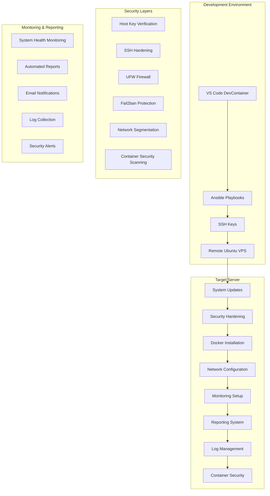
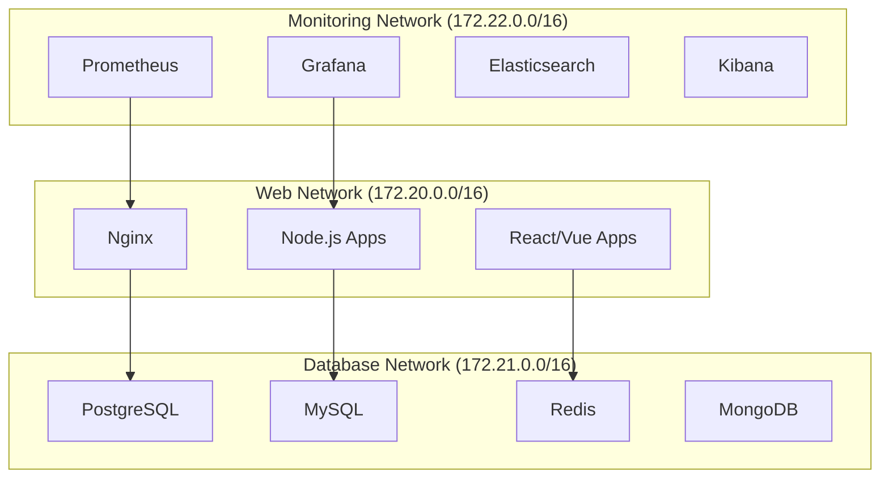
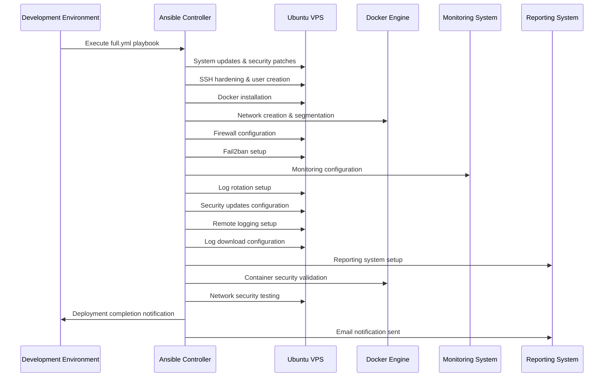
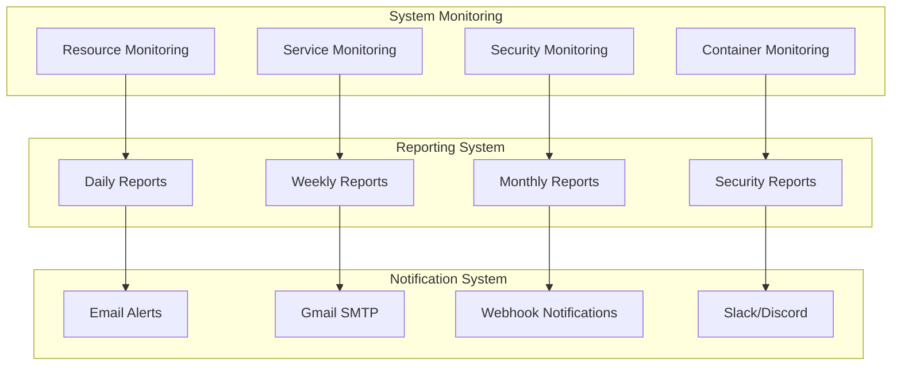

# Architecture Overview

## System Architecture

This project implements a **secure, automated infrastructure deployment system** using Ansible to provision and configure Ubuntu VPS servers for Docker-based applications with comprehensive monitoring, reporting, and security features.

### High-Level Architecture

## Core Components

### 1. Development Environment (`.devcontainer/`)

**Purpose**: Provides a consistent, isolated development environment with all necessary tools.

**Components**:

- **Docker Container**: Ubuntu-based container with Ansible, Docker tools
- **VS Code Integration**: Pre-configured extensions for Ansible, YAML, Docker
- **SSH Key Management**: Secure key handling and agent setup
- **Environment Configuration**: Git, Python, and tool version management

**Key Features**:

- Ansible 9.2.0 with linting support
- Docker CLI and container management tools
- SSH agent with automatic key loading
- Custom shell prompt with project context
- Environment validation and error handling

### 2. Ansible Infrastructure (`src/`)

**Purpose**: Orchestrates the complete server deployment and configuration process.

**Components**:

#### Playbooks (`src/playbooks/`)

- **`full.yml`**: Complete system deployment orchestration (main playbook)
- **`preflight_check.yml`**: System validation before deployment
- **`download_logs_secure.yml`**: Secure log download and analysis
- **`test_container_security.yml`**: Container security validation
- **`test_handlers.yml`**: Service handler testing
- **`cleanup_docker_images.yml`**: Docker image cleanup and maintenance
- **`close_unnecessary_ports.yml`**: Port security management
- **`test_network_security.yml`**: Network security validation
- **`configure_security_updates.yml`**: Security update configuration
- **`reboot_server.yml`**: Safe server reboot procedures
- **`show_network_info.yml`**: Network configuration display
- **`configure_monitoring.yml`**: Monitoring system setup
- **`diagnose_fail2ban.yml`**: Fail2ban diagnostics and management
- **`clean_old_upgrade_errors.yml`**: System upgrade error cleanup

#### Roles (`src/roles/`)

Each role implements a specific server function:

**System Management**:

- `update_ubuntu/`: System updates and package management
- `configure_security_updates/`: Automatic security update configuration
- `create_deployment_user/`: Dedicated user creation with proper permissions

**Security**:

- `disable_password_authentication/`: SSH security hardening
- `configure_firewall/`: UFW firewall configuration
- `configure_fail2ban/`: Intrusion prevention setup
- `configure_container_security/`: Docker security hardening with Trivy scanning

**Docker & Networking**:

- `deploy_docker/`: Docker installation and daemon configuration
- `configure_docker_networks/`: Secure network segmentation
- `test_network_security/`: Network security validation

**Monitoring & Maintenance**:

- `configure_monitoring/`: System health monitoring setup
- `configure_log_rotation/`: Automated log management
- `configure_remote_logging/`: Centralized logging configuration
- `configure_log_download/`: Secure log collection and analysis
- `configure_reporting/`: Automated system reporting with email delivery

#### Inventory (`src/inventory/`)

- **`hosts.yml`**: Server definitions and group organization
- **`known_hosts`**: SSH host key verification
- **`group_vars/`**: Unified environment configuration structure:
  - `all/main.yml`: All environment configuration variables
  - `all/vault.yml`: Encrypted sensitive variables (Ansible Vault)
- **`host_vars/`**: Host-specific variable overrides
- **`SECURITY.md`**: Security configuration documentation
- **`README.md`**: Inventory management guide

#### Configuration (`src/`)

- **`ansible.cfg`**: Default secure configuration
- **Environment overrides**: Use environment variables for development-specific settings

### 3. Security Architecture

#### Multi-Layer Security Approach

**Security Layers**:

1. **Connection Security**:

   - SSH host key verification prevents MITM attacks
   - Password authentication disabled
   - Key-based authentication only
   - Strict host key checking enabled

2. **Network Security**:

   - UFW firewall with default deny policy
   - Specific Docker network ranges (172.20.0.0/16, 172.21.0.0/16, 172.22.0.0/16)
   - Blocked broad ranges (172.16.0.0/12, 192.168.0.0/16, 10.0.0.0/8)
   - Network traffic logging and monitoring

3. **Container Security**:

   - Network segmentation by service type
   - Restricted container privileges
   - Trivy vulnerability scanning
   - Security scanning and validation
   - Isolated network communication

4. **System Security**:

   - Fail2ban for SSH brute force protection
   - Automatic security updates
   - Log rotation and monitoring
   - User privilege restrictions
   - Ansible Vault for sensitive data encryption

### 4. Network Architecture

#### Docker Network Segmentation

**Network Policies**:

- **Isolation**: Services on different networks cannot communicate directly
- **Controlled Access**: Only necessary inter-network communication allowed
- **Audit Trail**: All network activity logged and monitored
- **Security Zones**: Clear separation of concerns by network type

### 5. Deployment Flow

#### Complete Deployment Process

### 6. Environment Configuration

#### Unified Environment Structure

The project now uses a **unified environment configuration** approach for simplified management:

**Configuration Files**:

- **`src/inventory/group_vars/all/main.yml`**: All environment configuration variables
- **`secrets/vault.yml`**: Encrypted sensitive data (Ansible Vault)
- **`secrets/.env`**: Environment variables for development
- **`secrets/.vault_pass`**: Vault password file

**Key Features**:

- **Single Environment**: Simplified configuration management
- **Vault Encryption**: All sensitive data encrypted with Ansible Vault
- **Environment Variables**: Development-specific overrides via `.env` file
- **Secure Secrets**: Comprehensive protection of sensitive information

### 7. Monitoring & Reporting System

#### Comprehensive Monitoring Architecture

#### System Health Monitoring

- **Resource Monitoring**: CPU, memory, disk usage (every 2 minutes)
- **Service Monitoring**: Docker containers, system services (every 5 minutes)
- **Security Monitoring**: Failed login attempts, network anomalies
- **Container Security**: Trivy vulnerability scanning with alerts
- **Log Management**: Automated rotation, analysis, and secure collection

#### Automated Reporting

- **Daily Reports**: System health, security events, resource usage (6:00 AM)
- **Weekly Reports**: Extended analysis with trends and statistics (Sunday 7:00 AM)
- **Monthly Reports**: Comprehensive system analysis with long-term trends (1st of month 8:00 AM)
- **Security Reports**: Vulnerability scans, failed login attempts, security alerts
- **Email Delivery**: Beautiful HTML reports via Gmail SMTP

#### Maintenance Procedures

- **Automatic Updates**: Security patches and system updates
- **Log Rotation**: Prevent disk space issues with configurable retention
- **Backup Procedures**: Configuration and data backup
- **Recovery Procedures**: System restoration and rollback
- **Log Collection**: Secure log download and analysis

### 8. Deployment Scripts

#### Automation Scripts (`scripts/`)

- **`deploy-full.sh`**: Complete system deployment with environment validation
- **`run-ansible.sh`**: Ansible execution wrapper with proper environment setup
- **`sync_git.sh`**: Git synchronization and backup utilities

**Key Features**:

- **Environment Validation**: Comprehensive prerequisite checking
- **Error Handling**: Robust error detection and reporting
- **User Confirmation**: Interactive deployment confirmation
- **Status Reporting**: Clear deployment progress and completion status

### 9. Examples and Templates

#### Example Configurations (`examples/`)

- **`docker-compose.secure.yml`**: Secure Docker Compose template with network segmentation
- **`inventory-setup.md`**: Inventory configuration guide
- **`DEPLOYMENT_GUIDE.md`**: Step-by-step deployment instructions
- **`group_vars/`**: Example environment configurations

**Key Features**:

- **Production-Ready Templates**: Secure, tested configurations
- **Network Segmentation**: Proper Docker network isolation
- **Security Best Practices**: Comprehensive security measures
- **Documentation**: Detailed setup and configuration guides

## Technology Stack

### Core Technologies

- **Ansible**: Infrastructure automation and configuration management
- **Docker**: Containerization and application deployment
- **Ubuntu**: Target operating system
- **Python**: Ansible and tooling runtime

### Security Technologies

- **SSH**: Secure remote access with key-based authentication
- **UFW**: Uncomplicated firewall for network security
- **Fail2ban**: Intrusion prevention and protection
- **Docker Networks**: Network segmentation and isolation
- **Ansible Vault**: Sensitive data encryption
- **Trivy**: Container vulnerability scanning

### Development Tools

- **VS Code**: Integrated development environment
- **DevContainers**: Isolated development environment
- **Git**: Version control and collaboration
- **Ansible Lint**: Code quality and best practices

### Monitoring & Maintenance

- **Systemd**: Service management and monitoring
- **Logrotate**: Automated log management
- **Cron**: Scheduled maintenance tasks
- **Email Notifications**: Security update alerts
- **Prometheus Node Exporter**: System metrics collection
- **Custom Monitoring Scripts**: Resource and service monitoring

### Reporting & Communication

- **Gmail SMTP**: Secure email delivery
- **HTML Reports**: Beautiful, formatted system reports
- **Cron Jobs**: Automated report generation
- **Webhook Support**: Slack, Discord, and custom webhook notifications

## Resource Usage (2GB RAM VPS)

| Component | RAM Usage | CPU Usage | Status |
|-----------|-----------|-----------|---------|
| **Prometheus Node Exporter** | ~50MB | ~0.1 cores | Running |
| **Container Security (Trivy)** | ~100MB | ~0.2 cores | Active |
| **Monitoring Scripts** | ~50MB | ~0.1 cores | Active |
| **Reporting System** | ~50MB | ~0.1 cores | Active |
| **Security Tools** | ~100MB | ~0.1 cores | Active |
| **Total Monitoring** | ~350MB | ~0.6 cores | Optimized |
| **Available for Applications** | ~1.65GB | ~1.4 cores | Ready |

## Scalability Considerations

### Multi-Server Deployment

- **Inventory Management**: Support for multiple server groups
- **Parallel Execution**: Ansible's parallel task execution
- **Load Balancing**: Docker network support for load balancers
- **Centralized Monitoring**: Multi-server monitoring aggregation
- **Unified Configuration**: Single environment configuration for consistency

### Environment Scaling

- **Single Environment**: Simplified configuration management
- **Vault Encryption**: Secure multi-server configuration
- **Automated Deployment**: Script-based deployment automation
- **Disaster Recovery**: Backup and recovery procedures
- **Monitoring Aggregation**: Centralized reporting and alerting

This architecture provides a robust, secure, and scalable foundation for deploying and managing containerized applications on Ubuntu VPS servers with comprehensive monitoring, reporting, and security features.
