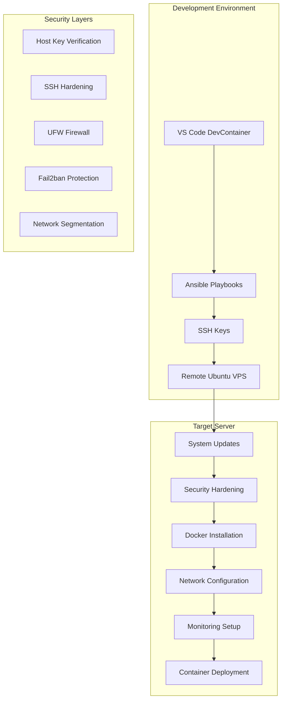
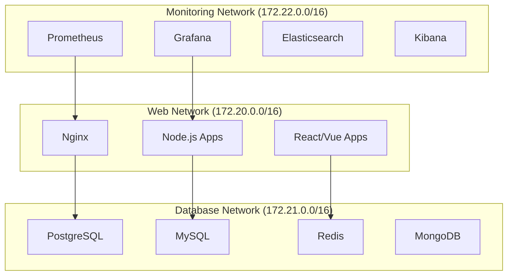
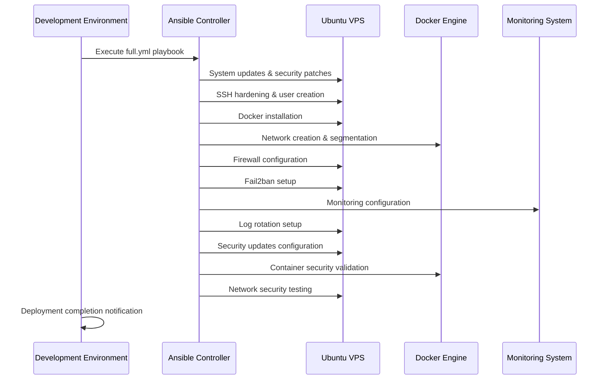

# Architecture Overview

## System Architecture

This project implements a **secure, automated infrastructure deployment system** using Ansible to provision and configure Ubuntu VPS servers for Docker-based applications.

### High-Level Architecture

## Core Components

### 1. Development Environment (`.devcontainer/`)

**Purpose**: Provides a consistent, isolated development environment with all necessary tools.

**Components**:

- **Docker Container**: Ubuntu-based container with Ansible, Docker tools
- **VS Code Integration**: Pre-configured extensions for Ansible, YAML, Docker
- **SSH Key Management**: Secure key handling and agent setup
- **Environment Configuration**: Git, Python, and tool version management

**Key Features**:

- Ansible 9.2.0 with linting support
- Docker CLI and container management tools
- SSH agent with automatic key loading
- Custom shell prompt with project context
- Environment validation and error handling

### 2. Ansible Infrastructure (`src/`)

**Purpose**: Orchestrates the complete server deployment and configuration process.

**Components**:

#### Playbooks (`src/playbooks/`)

- **`full.yml`**: Complete system deployment orchestration (main playbook)
- **`preflight_check.yml`**: System validation before deployment
- **`download_logs_secure.yml`**: Secure log download and analysis
- **`test_container_security.yml`**: Container security validation
- **`test_handlers.yml`**: Service handler testing
- **`cleanup_docker_images.yml`**: Docker image cleanup and maintenance
- **`close_unnecessary_ports.yml`**: Port security management
- **`test_network_security.yml`**: Network security validation
- **`configure_security_updates.yml`**: Security update configuration
- **`reboot_server.yml`**: Safe server reboot procedures
- **`show_network_info.yml`**: Network configuration display
- **`configure_monitoring.yml`**: Monitoring system setup

**Note**: Individual role playbooks have been consolidated into the main `full.yml` playbook for better maintainability and consistency.

#### Roles (`src/roles/`)

Each role implements a specific server function:

**System Management**:

- `update_ubuntu/`: System updates and package management
- `configure_security_updates/`: Automatic security update configuration
- `create_deployment_user/`: Dedicated user creation with proper permissions

**Security**:

- `disable_password_authentication/`: SSH security hardening
- `configure_firewall/`: UFW firewall configuration
- `configure_fail2ban/`: Intrusion prevention setup
- `configure_container_security/`: Docker security hardening

**Docker & Networking**:

- `deploy_docker/`: Docker installation and daemon configuration
- `configure_docker_networks/`: Secure network segmentation
- `test_network_security/`: Network security validation

**Monitoring & Maintenance**:

- `configure_monitoring/`: System health monitoring setup
- `configure_log_rotation/`: Automated log management
- `configure_remote_logging/`: Centralized logging configuration

#### Inventory (`src/inventory/`)

- **`hosts.yml`**: Server definitions and group organization
- **`known_hosts`**: SSH host key verification
- **`group_vars/`**: Environment-specific configuration structure:
  - `all/vault.yml`: Encrypted sensitive variables
  - `production/main.yml`: Production environment settings
  - `staging/main.yml`: Staging environment settings
  - `development/main.yml`: Development environment settings

#### Configuration (`src/`)

- **`ansible.cfg`**: Default secure configuration
- **Environment overrides**: Use environment variables for development-specific settings

### 3. Security Architecture

#### Multi-Layer Security Approach

**Security Layers**:

1. **Connection Security**:

   - SSH host key verification prevents MITM attacks
   - Password authentication disabled
   - Key-based authentication only
   - Strict host key checking enabled

2. **Network Security**:

   - UFW firewall with default deny policy
   - Specific Docker network ranges (172.20.0.0/16, 172.21.0.0/16, 172.22.0.0/16)
   - Blocked broad ranges (172.16.0.0/12, 192.168.0.0/16, 10.0.0.0/8)
   - Network traffic logging and monitoring

3. **Container Security**:

   - Network segmentation by service type
   - Restricted container privileges
   - Security scanning and validation
   - Isolated network communication

4. **System Security**:

   - Fail2ban for SSH brute force protection
   - Automatic security updates
   - Log rotation and monitoring
   - User privilege restrictions

### 4. Network Architecture

#### Docker Network Segmentation

**Network Policies**:

- **Isolation**: Services on different networks cannot communicate directly
- **Controlled Access**: Only necessary inter-network communication allowed
- **Audit Trail**: All network activity logged and monitored
- **Security Zones**: Clear separation of concerns by network type

### 5. Deployment Flow

#### Complete Deployment Process

### 6. Environment Configurations

#### Development Environment

- **Purpose**: Testing and development with relaxed security
- **Configuration**: Use environment variables to override secure defaults
- **Features**:

  - Host key checking can be disabled via `ANSIBLE_HOST_KEY_CHECKING=False`
  - Verbose logging
  - Development-specific variables
  - Testing tools and utilities

#### Production Environment

- **Purpose**: Secure production deployments
- **Configuration**: Uses default secure `ansible.cfg` settings
- **Features**:

  - Strict host key verification
  - Comprehensive security measures
  - Production monitoring
  - Automated security updates

### 7. Monitoring & Maintenance

#### System Health Monitoring

- **Resource Monitoring**: CPU, memory, disk usage
- **Service Monitoring**: Docker containers, system services
- **Security Monitoring**: Failed login attempts, network anomalies
- **Log Management**: Automated rotation and analysis

#### Maintenance Procedures

- **Automatic Updates**: Security patches and system updates
- **Log Rotation**: Prevent disk space issues
- **Backup Procedures**: Configuration and data backup
- **Recovery Procedures**: System restoration and rollback

## Technology Stack

### Core Technologies

- **Ansible**: Infrastructure automation and configuration management
- **Docker**: Containerization and application deployment
- **Ubuntu**: Target operating system
- **Python**: Ansible and tooling runtime

### Security Technologies

- **SSH**: Secure remote access with key-based authentication
- **UFW**: Uncomplicated firewall for network security
- **Fail2ban**: Intrusion prevention and protection
- **Docker Networks**: Network segmentation and isolation

### Development Tools

- **VS Code**: Integrated development environment
- **DevContainers**: Isolated development environment
- **Git**: Version control and collaboration
- **Ansible Lint**: Code quality and best practices

### Monitoring & Maintenance

- **Systemd**: Service management and monitoring
- **Logrotate**: Automated log management
- **Cron**: Scheduled maintenance tasks
- **Email Notifications**: Security update alerts

## Scalability Considerations

### Multi-Server Deployment

- **Inventory Management**: Support for multiple server groups
- **Parallel Execution**: Ansible's parallel task execution
- **Load Balancing**: Docker network support for load balancers
- **Centralized Monitoring**: Multi-server monitoring aggregation

### Environment Scaling

- **Development**: Single server testing environment
- **Staging**: Multi-server staging environment
- **Production**: High-availability production environment
- **Disaster Recovery**: Backup and recovery procedures

This architecture provides a robust, secure, and scalable foundation for deploying and managing containerized applications on Ubuntu VPS servers.
