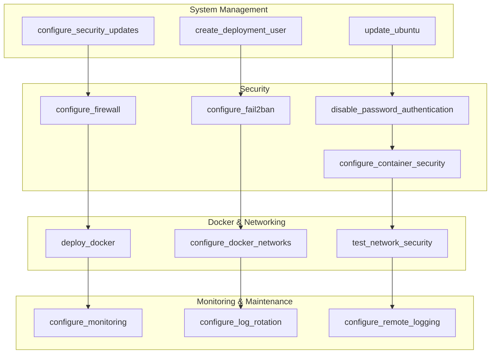

# Ansible Roles Documentation

## Overview

This project uses a modular Ansible role architecture to organize and maintain server configuration tasks. Each role implements a specific server function and can be used independently or as part of the complete deployment process.

## Role Architecture

### Role Organization



## Role Details

### 1. System Management Roles

#### update_ubuntu

**Purpose**: Performs system updates and security patches on Ubuntu servers.

**Tasks**:

- Update package lists
- Upgrade installed packages
- Install security updates
- Clean up package cache
- Reboot if required

**Variables**:

```yaml
update_ubuntu_reboot_required: false
update_ubuntu_automatic_reboot: false
update_ubuntu_reboot_timeout: 300
```

**Usage**:

```bash
# Run system updates using tags
ansible-playbook --tags "update_ubuntu" playbooks/full.yml

# With custom variables
ansible-playbook --tags "update_ubuntu" playbooks/full.yml -e "update_ubuntu_automatic_reboot=true"
```

**Dependencies**: None

**Output**: Updated system packages and security patches

---

#### configure_security_updates

**Purpose**: Configures automatic security updates and email notifications.

**Tasks**:

- Install unattended-upgrades package
- Configure automatic security updates
- Set up email notifications
- Configure update schedules
- Test notification system

**Variables**:

```yaml
configure_security_updates_email: "admin@example.com"
configure_security_updates_gmail_enabled: true
configure_security_updates_gmail_user: "your-email@gmail.com"
configure_security_updates_gmail_password: "your-app-password"
configure_security_updates_gmail_smtp_server: "smtp.gmail.com"
configure_security_updates_gmail_smtp_port: "465"
```

**Usage**:

```bash
# Configure security updates using tags
ansible-playbook --tags "configure_security_updates" playbooks/full.yml
```

**Dependencies**: update_ubuntu

**Output**: Automatic security updates with email notifications

---

#### create_deployment_user

**Purpose**: Creates a dedicated deployment user with proper permissions.

**Tasks**:

- Create deployment user account
- Set up SSH key authentication
- Configure sudo privileges
- Set up user environment
- Configure SSH access

**Variables**:

```yaml
containers_deployment_user: "docker_deployment"
containers_deployment_user_ssh_key: "~/.ssh/deployment-key"
containers_deployment_user_ssh_key_public: "/path/to/public/key.pub"
containers_deployment_user_sudo_nopasswd: true
```

**Usage**:

```bash
# Create deployment user using tags
ansible-playbook --tags "create_deployment_user" playbooks/full.yml
```

**Dependencies**: None

**Output**: Dedicated deployment user with SSH and sudo access

---

### 2. Security Roles

#### disable_password_authentication

**Purpose**: Hardens SSH security by disabling password authentication.

**Tasks**:

- Disable password authentication
- Disable root login
- Configure SSH security settings
- Validate SSH configuration

**Variables**:

```yaml
disable_password_authentication_ssh_port: "22"
disable_password_authentication_permit_root_login: false
disable_password_authentication_password_authentication: false
disable_password_authentication_pubkey_authentication: true
```

**Usage**:

```bash
# Configure SSH security using tags
ansible-playbook --tags "disable_password_authentication" playbooks/full.yml
```

**Dependencies**: create_deployment_user

**Output**: Secure SSH configuration with key-based authentication only

---

#### configure_firewall

**Purpose**: Configures UFW firewall with secure rules and Docker network access.

**Tasks**:

- Install and configure UFW
- Set default policies (deny incoming, allow outgoing)
- Allow SSH access (port 22)
- Allow HTTP/HTTPS access (ports 80, 443)
- Configure Docker network access
- Enable firewall logging

**Variables**:

```yaml
configure_firewall_enabled: true
configure_firewall_ssh_port: "22"
configure_firewall_http_port: "80"
configure_firewall_https_port: "443"
configure_firewall_docker_networks:
  - "172.20.0.0/16"
  - "172.21.0.0/16"
  - "172.22.0.0/16"
```

**Usage**:

```bash
# Configure firewall using tags
ansible-playbook --tags "configure_firewall" playbooks/full.yml
```

**Dependencies**: update_ubuntu

**Output**: Secure firewall configuration with Docker network access

---

#### configure_fail2ban

**Purpose**: Configures Fail2ban for intrusion prevention and SSH protection.

**Tasks**:

- Install Fail2ban package
- Configure SSH protection rules
- Set ban time and find time parameters
- Configure email notifications
- Enable and start service

**Variables**:

```yaml
configure_fail2ban_enabled: true
configure_fail2ban_ban_time: 3600
configure_fail2ban_find_time: 600
configure_fail2ban_max_retry: 3
configure_fail2ban_email: "admin@example.com"
```

**Usage**:

```bash
# Configure Fail2ban using tags
ansible-playbook --tags "configure_fail2ban" playbooks/full.yml
```

**Dependencies**: configure_firewall

**Output**: Active intrusion prevention with SSH protection

---

#### configure_container_security

**Purpose**: Implements container security scanning and monitoring with Trivy.

**Tasks**:

- Install Trivy vulnerability scanner
- Configure container security policies
- Set up automated scanning
- Configure security thresholds
- Generate HTML vulnerability reports

**Variables**:

```yaml
configure_container_security_enabled: true
configure_container_security_trivy_enabled: true
configure_container_security_scan_schedule: "0 2 * * *"
configure_container_security_critical_threshold: 0
configure_container_security_high_threshold: 5
```

**Usage**:

```bash
# Configure container security using tags
ansible-playbook --tags "configure_container_security" playbooks/full.yml
```

**Dependencies**: deploy_docker

**Output**: Active container security scanning and monitoring

---

### 3. Docker & Networking Roles

#### deploy_docker

**Purpose**: Installs and configures Docker on Ubuntu servers.

**Tasks**:

- Install Docker packages
- Configure Docker daemon
- Start and enable Docker service
- Add user to docker group
- Configure Docker logging

**Variables**:

```yaml
deploy_docker_enabled: true
deploy_docker_clean_slate: false
deploy_docker_remove_existing: false
deploy_docker_log_max_size: "10m"
deploy_docker_log_max_files: "3"
```

**Usage**:

```bash
# Deploy Docker using tags
ansible-playbook --tags "deploy_docker" playbooks/full.yml
```

**Dependencies**: update_ubuntu

**Output**: Fully functional Docker installation with secure configuration

---

#### configure_docker_networks

**Purpose**: Creates and configures secure Docker networks with network segmentation.

**Tasks**:

- Create web application network (172.20.0.0/16)
- Create database network (172.21.0.0/16)
- Create monitoring network (172.22.0.0/16)
- Configure network isolation
- Set up network policies

**Variables**:

```yaml
configure_docker_networks_enabled: true
configure_docker_networks_default_networks:
  - name: "web-network"
    subnet: "172.20.0.0/16"
    driver: "bridge"
  - name: "db-network"
    subnet: "172.21.0.0/16"
    driver: "bridge"
  - name: "monitoring-network"
    subnet: "172.22.0.0/16"
    driver: "bridge"
configure_docker_networks_remove_all: false
```

**Usage**:

```bash
# Configure Docker networks using tags
ansible-playbook --tags "configure_docker_networks" playbooks/full.yml
```

**Dependencies**: deploy_docker

**Output**: Secure Docker networks with proper isolation

---

#### test_network_security

**Purpose**: Tests network security configuration and validates firewall rules.

**Tasks**:

- Verify UFW firewall status
- Test SSH access rules
- Validate Docker network isolation
- Check port accessibility
- Generate security report

**Variables**:

```yaml
test_network_security_enabled: true
features:
  containers:
    networks:
      test_mode: true
```

**Usage**:

```bash
# Test network security using tags
ansible-playbook --tags "test_network_security" playbooks/full.yml
```

**Dependencies**: configure_firewall, configure_docker_networks

**Output**: Network security validation report

---

### 4. Monitoring & Maintenance Roles

#### configure_monitoring

**Purpose**: Sets up lightweight system monitoring and health checks.

**Tasks**:

- Install monitoring tools
- Configure health check scripts
- Set up resource monitoring
- Configure alerting system
- Start monitoring services

**Variables**:

```yaml
configure_monitoring_enabled: true
configure_monitoring_health_check_interval: 360
configure_monitoring_resource_check_interval: 120
configure_monitoring_container_check_interval: 300
```

**Usage**:

```bash
# Configure monitoring using tags
ansible-playbook --tags "configure_monitoring" playbooks/full.yml
```

**Dependencies**: deploy_docker

**Output**: Active system monitoring with health checks

---

#### configure_log_rotation

**Purpose**: Configures automated log rotation and management.

**Tasks**:

- Configure logrotate for system logs
- Set up Docker log rotation
- Configure log retention policies
- Set up log compression
- Configure log monitoring

**Variables**:

```yaml
configure_log_rotation_enabled: true
configure_log_rotation_retention_days: 7
configure_log_rotation_compress: true
configure_log_rotation_missing_ok: true
```

**Usage**:

```bash
# Configure log rotation using tags
ansible-playbook --tags "configure_log_rotation" playbooks/full.yml
```

**Dependencies**: deploy_docker

**Output**: Automated log management with retention policies

---

#### configure_remote_logging

**Purpose**: Sets up secure remote logging and log analysis.

**Tasks**:

- Configure rsyslog for remote logging
- Set up log encryption
- Configure log forwarding
- Set up log analysis tools
- Configure log retention

**Variables**:

```yaml
configure_remote_logging_enabled: true
configure_remote_logging_server: "log-server.example.com"
configure_remote_logging_port: "514"
configure_remote_logging_protocol: "tcp"
```

**Usage**:

```bash
# Configure remote logging using tags
ansible-playbook --tags "configure_remote_logging" playbooks/full.yml
```

**Dependencies**: configure_log_rotation

**Output**: Centralized logging configuration

---

## Role Execution Order

### Recommended Execution Sequence

**Note**: Individual role execution is now handled through tags on the main playbook. The following shows the logical order of role execution:

1. **System Preparation**
   - `update_ubuntu` - System updates and security patches
   - `create_deployment_user` - Create deployment user

2. **Security Configuration**
   - `disable_password_authentication` - SSH security hardening
   - `configure_firewall` - UFW firewall configuration
   - `configure_fail2ban` - Intrusion prevention

3. **Docker Deployment**
   - `deploy_docker` - Docker installation and configuration
   - `configure_docker_networks` - Network segmentation
   - `configure_container_security` - Security scanning

4. **Monitoring & Maintenance**
   - `configure_monitoring` - System monitoring setup
   - `configure_log_rotation` - Log management
   - `configure_remote_logging` - Centralized logging

5. **Validation**
   - `test_network_security` - Security validation

### Complete Deployment

```bash
# Run all roles in correct order
ansible-playbook playbooks/full.yml
```

### Individual Role Execution

```bash
# Execute specific roles using tags
ansible-playbook --tags "update_ubuntu,configure_firewall" playbooks/full.yml

# Skip specific roles
ansible-playbook --skip-tags "configure_monitoring" playbooks/full.yml

# Execute roles in sequence
ansible-playbook --tags "update_ubuntu" playbooks/full.yml
ansible-playbook --tags "configure_firewall" playbooks/full.yml
ansible-playbook --tags "deploy_docker" playbooks/full.yml
```

## Role Customization

### 1. Variable Override

```bash
# Override role variables using tags
ansible-playbook --tags "configure_firewall" playbooks/full.yml -e "configure_firewall_ssh_port=2222"
```

### 2. Custom Role Configuration

```yaml
# In inventory/group_vars/production/main.yml
configure_docker_networks_custom_networks:
  - name: "api-network"
    subnet: "172.23.0.0/16"
    driver: "bridge"
    options:
      com.docker.network.bridge.name: "api-br0"
```

### 3. Role Dependencies

```yaml
# In role meta/main.yml
dependencies:
  - role: update_ubuntu
  - role: configure_firewall
```

## Role Testing

### 1. Syntax Check

```bash
# Check role syntax
ansible-playbook --syntax-check playbooks/full.yml
```

### 2. Dry Run

```bash
# Test role execution without changes
ansible-playbook --check playbooks/full.yml

# Test specific roles
ansible-playbook --check --tags "configure_firewall" playbooks/full.yml
```

### 3. Verbose Execution

```bash
# Verbose output for debugging
ansible-playbook -vvv playbooks/full.yml

# Verbose output for specific roles
ansible-playbook -vvv --tags "deploy_docker" playbooks/full.yml
```

### 4. Role-Specific Testing

```bash
# Test individual roles with dry run
ansible-playbook --check --tags "update_ubuntu" playbooks/full.yml
ansible-playbook --check --tags "configure_firewall" playbooks/full.yml
ansible-playbook --check --tags "deploy_docker" playbooks/full.yml
```

## Role Development

### 1. Creating New Roles

```bash
# Create role structure
mkdir -p src/roles/new_role/{tasks,handlers,defaults,vars,meta,templates}

# Create main task file
touch src/roles/new_role/tasks/main.yml
```

### 2. Role Integration

```yaml
# Add to playbooks/full.yml
roles:
  - new_role
```

### 3. Role Testing

```bash
# Test new role
ansible-playbook --check --tags "new_role" playbooks/full.yml

# Test with full deployment
ansible-playbook --tags "new_role" playbooks/full.yml
```

This documentation now reflects the current project structure where all roles are executed through the main `playbooks/full.yml` playbook using tags, rather than through individual broken playbook files.
