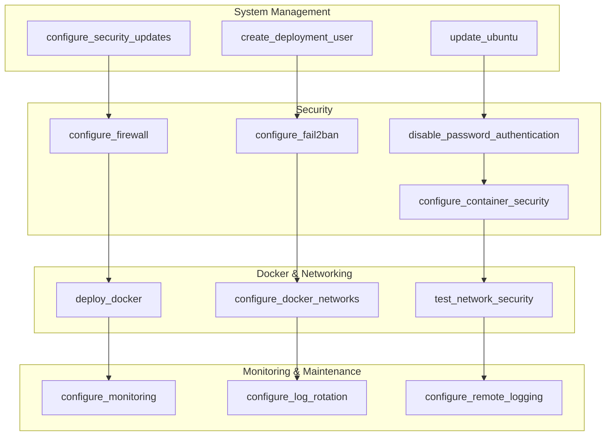

# Ansible Roles Documentation

## Overview

This project uses a modular Ansible role architecture to organize and maintain server configuration tasks. Each role implements a specific server function and can be used independently or as part of the complete deployment process.

## Role Architecture

### Role Organization



## Role Details

### 1. System Management Roles

#### update_ubuntu

**Purpose**: Performs system updates and security patches on Ubuntu servers.

**Tasks**:

- Update package lists
- Upgrade installed packages
- Install security updates
- Clean up package cache
- Reboot if required

**Variables**:

```yaml
update_ubuntu_reboot_required: false
update_ubuntu_automatic_reboot: false
update_ubuntu_reboot_timeout: 300
```

**Usage**:

```bash
# Run system updates
ansible-playbook playbooks/update_ubuntu.yml

# With custom variables
ansible-playbook playbooks/update_ubuntu.yml -e "update_ubuntu_automatic_reboot=true"
```

**Dependencies**: None

**Output**: Updated system packages and security patches

---

#### configure_security_updates

**Purpose**: Configures automatic security updates and email notifications.

**Tasks**:

- Install unattended-upgrades package
- Configure automatic security updates
- Set up email notifications
- Configure update schedules
- Test notification system

**Variables**:

```yaml
configure_security_updates_email: "admin@example.com"
configure_security_updates_gmail_enabled: true
configure_security_updates_gmail_user: "your-email@gmail.com"
configure_security_updates_gmail_password: "your-app-password"
configure_security_updates_gmail_smtp_server: "smtp.gmail.com"
configure_security_updates_gmail_smtp_port: "465"
```

**Usage**:

```bash
# Configure security updates
ansible-playbook playbooks/configure_security_updates.yml
```

**Dependencies**: update_ubuntu

**Output**: Automatic security updates with email notifications

---

#### create_deployment_user

**Purpose**: Creates a dedicated deployment user with proper permissions.

**Tasks**:

- Create deployment user account
- Set up SSH key authentication
- Configure sudo privileges
- Set up user environment
- Configure SSH access

**Variables**:

```yaml
containers_deployment_user: "docker_deployment"
containers_deployment_user_ssh_key: "~/.ssh/deployment-key"
containers_deployment_user_ssh_key_public: "/path/to/public/key.pub"
containers_deployment_user_sudo_nopasswd: true
```

**Usage**:

```bash
# Create deployment user
ansible-playbook playbooks/create_deployment_user.yml
```

**Dependencies**: None

**Output**: Dedicated deployment user with SSH and sudo access

---

### 2. Security Roles

#### disable_password_authentication

**Purpose**: Hardens SSH security by disabling password authentication.

**Tasks**:

- Disable password authentication
- Disable root login
- Configure key-based authentication
- Set SSH security parameters
- Restart SSH service

**Variables**:

```yaml
disable_password_authentication_ssh_port: 22
disable_password_authentication_permit_root_login: false
disable_password_authentication_password_authentication: false
disable_password_authentication_pubkey_authentication: true
```

**Usage**:

```bash
# Disable password authentication
ansible-playbook playbooks/disable_password_authentication.yml
```

**Dependencies**: create_deployment_user

**Output**: SSH security hardening with key-based authentication only

---

#### configure_firewall

**Purpose**: Configures UFW firewall with secure Docker network rules.

**Tasks**:

- Install and enable UFW
- Configure default policies
- Allow SSH access
- Configure Docker network rules
- Block broad network ranges
- Enable logging

**Variables**:

```yaml
configure_firewall_enabled: true
configure_firewall_default_policy: "deny"
configure_firewall_ssh_port: 22
configure_firewall_web_ports: [80, 443]
configure_firewall_docker_networks:
  - "172.20.0.0/16"
  - "172.21.0.0/16"
  - "172.22.0.0/16"
configure_firewall_blocked_ranges:
  - "172.16.0.0/12"
  - "192.168.0.0/16"
  - "10.0.0.0/8"
```

**Usage**:

```bash
# Configure firewall
ansible-playbook playbooks/configure_firewall.yml
```

**Dependencies**: None

**Output**: Secure firewall configuration with Docker network support

---

#### configure_fail2ban

**Purpose**: Configures fail2ban for SSH brute force protection.

**Tasks**:

- Install fail2ban package
- Configure SSH protection
- Set up ban rules and durations
- Configure whitelist
- Enable fail2ban service

**Variables**:

```yaml
configure_fail2ban_enabled: true
configure_fail2ban_ssh_port: 22
configure_fail2ban_max_retry: 3
configure_fail2ban_bantime: 3600
configure_fail2ban_findtime: 600
configure_fail2ban_whitelist: []
```

**Usage**:

```bash
# Configure fail2ban
ansible-playbook playbooks/configure_fail2ban.yml
```

**Dependencies**: None

**Output**: SSH brute force protection with configurable rules

---

#### configure_container_security

**Purpose**: Implements Docker container security hardening.

**Tasks**:

- Configure Docker daemon security
- Set up user namespace remapping
- Configure container privileges
- Set up security scanning
- Configure resource limits

**Variables**:

```yaml
configure_container_security_enabled: true
configure_container_security_userns_remap: true
configure_container_security_no_new_privileges: true
configure_container_security_live_restore: true
configure_container_security_log_driver: "json-file"
configure_container_security_log_opts:
  max_size: "10m"
  max_file: "3"
```

**Usage**:

```bash
# Configure container security
ansible-playbook playbooks/configure_container_security.yml
```

**Dependencies**: deploy_docker

**Output**: Hardened Docker container security configuration

---

### 3. Docker & Networking Roles

#### deploy_docker

**Purpose**: Installs and configures Docker on Ubuntu servers.

**Tasks**:

- Install Docker dependencies
- Add Docker repository
- Install Docker CE
- Configure Docker daemon
- Start Docker service
- Add user to docker group

**Variables**:

```yaml
deploy_docker_version: "latest"
deploy_docker_install_method: "repository"
deploy_docker_daemon_config: {}
deploy_docker_user: "{{ containers_deployment_user }}"
```

**Usage**:

```bash
# Deploy Docker
ansible-playbook playbooks/deploy_docker.yml
```

**Dependencies**: None

**Output**: Docker installation with daemon configuration

---

#### configure_docker_networks

**Purpose**: Creates secure Docker networks with specific IP ranges.

**Tasks**:

- Create default networks
- Configure network subnets
- Set up network policies
- Configure network isolation
- Test network connectivity

**Variables**:

```yaml
configure_docker_networks_enabled: true
configure_docker_networks_default_networks:
  - name: "web-network"
    subnet: "172.20.0.0/16"
    driver: "bridge"
  - name: "db-network"
    subnet: "172.21.0.0/16"
    driver: "bridge"
  - name: "monitoring-network"
    subnet: "172.22.0.0/16"
    driver: "bridge"
configure_docker_networks_custom_networks: []
configure_docker_networks_isolation_enabled: true
```

**Usage**:

```bash
# Configure Docker networks
ansible-playbook playbooks/configure_docker_networks.yml
```

**Dependencies**: deploy_docker

**Output**: Secure Docker networks with network segmentation

---

#### test_network_security

**Purpose**: Validates network security configuration and isolation.

**Tasks**:

- Test firewall configuration
- Validate Docker networks
- Test network isolation
- Check container communication
- Generate security report

**Variables**:

```yaml
test_network_security_enabled: true
test_network_security_test_containers: true
test_network_security_verbose: false
test_network_security_generate_report: true
```

**Usage**:

```bash
# Test network security
ansible-playbook playbooks/test_network_security.yml
```

**Dependencies**: configure_docker_networks, configure_firewall

**Output**: Network security validation report

---

### 4. Monitoring & Maintenance Roles

#### configure_monitoring

**Purpose**: Sets up system monitoring and health checks.

**Tasks**:

- Install monitoring tools
- Configure system monitoring
- Set up health checks
- Configure alerting
- Start monitoring services

**Variables**:

```yaml
configure_monitoring_enabled: true
configure_monitoring_alert_email: "admin@example.com"
configure_monitoring_alert_webhook: ""
configure_monitoring_check_interval: 300
configure_monitoring_retention_days: 30
```

**Usage**:

```bash
# Configure monitoring
ansible-playbook playbooks/configure_monitoring.yml
```

**Dependencies**: None

**Output**: System monitoring with health checks and alerts

---

#### configure_log_rotation

**Purpose**: Configures automated log management and rotation.

**Tasks**:

- Install logrotate
- Configure log rotation
- Set up log compression
- Configure log retention
- Test log rotation

**Variables**:

```yaml
configure_log_rotation_enabled: true
configure_log_rotation_max_size: "100M"
configure_log_rotation_keep_days: 30
configure_log_rotation_compress: true
configure_log_rotation_missingok: true
```

**Usage**:

```bash
# Configure log rotation
ansible-playbook playbooks/configure_log_rotation.yml
```

**Dependencies**: None

**Output**: Automated log management with rotation and compression

---

#### configure_remote_logging

**Purpose**: Sets up centralized logging for multiple servers.

**Tasks**:

- Configure remote logging
- Set up log forwarding
- Configure log aggregation
- Set up log storage
- Test remote logging

**Variables**:

```yaml
configure_remote_logging_enabled: false
configure_remote_logging_server: ""
configure_remote_logging_port: 514
configure_remote_logging_protocol: "udp"
configure_remote_logging_facility: "local0"
```

**Usage**:

```bash
# Configure remote logging
ansible-playbook playbooks/configure_remote_logging.yml
```

**Dependencies**: configure_log_rotation

**Output**: Centralized logging configuration

---

## Role Execution Order

### Recommended Execution Sequence

1. **System Preparation**

   ```bash
   ansible-playbook playbooks/update_ubuntu.yml
   ansible-playbook playbooks/create_deployment_user.yml
   ```

2. **Security Configuration**

   ```bash
   ansible-playbook playbooks/disable_password_authentication.yml
   ansible-playbook playbooks/configure_firewall.yml
   ansible-playbook playbooks/configure_fail2ban.yml
   ```

3. **Docker Deployment**

   ```bash
   ansible-playbook playbooks/deploy_docker.yml
   ansible-playbook playbooks/configure_docker_networks.yml
   ansible-playbook playbooks/configure_container_security.yml
   ```

4. **Monitoring & Maintenance**

   ```bash
   ansible-playbook playbooks/configure_monitoring.yml
   ansible-playbook playbooks/configure_log_rotation.yml
   ansible-playbook playbooks/configure_security_updates.yml
   ```

5. **Validation**

   ```bash
   ansible-playbook playbooks/test_network_security.yml
   ```

### Complete Deployment

```bash
# Run all roles in correct order
ansible-playbook playbooks/full.yml
```

## Role Customization

### 1. Variable Override

```bash
# Override role variables
ansible-playbook playbooks/configure_firewall.yml -e "configure_firewall_ssh_port=2222"
```

### 2. Custom Role Configuration

```yaml
# In inventory/group_vars/all.yml
configure_docker_networks_custom_networks:
  - name: "api-network"
    subnet: "172.23.0.0/16"
    driver: "bridge"
    options:
      com.docker.network.bridge.name: "api-br0"
```

### 3. Role Dependencies

```yaml
# In role meta/main.yml
dependencies:
  - role: update_ubuntu
  - role: configure_firewall
```

## Role Testing

### 1. Syntax Check

```bash
# Check role syntax
ansible-playbook --syntax-check playbooks/full.yml
```

### 2. Dry Run

```bash
# Test role execution without changes
ansible-playbook --check playbooks/full.yml
```

### 3. Verbose Execution

```bash
# Run with detailed output
ansible-playbook -vvv playbooks/full.yml
```

## Role Maintenance

### 1. Role Updates

```bash
# Update role dependencies
ansible-galaxy install -r requirements.yml --force
```

### 2. Role Validation

```bash
# Validate role structure
ansible-lint roles/
```

### 3. Role Documentation

```bash
# Generate role documentation
ansible-doc-extractor roles/ > roles_documentation.md
```

## Best Practices

### 1. Role Design

- Keep roles focused on single responsibility
- Use descriptive variable names
- Include proper error handling
- Document all variables and tasks
- Test roles independently

### 2. Role Organization

- Group related tasks in roles
- Use consistent naming conventions
- Maintain role dependencies
- Version control all role changes
- Document role interactions

### 3. Role Security

- Validate all inputs
- Use secure defaults
- Implement proper error handling
- Test security configurations
- Monitor role execution

This comprehensive role documentation provides detailed information about each role's purpose, configuration, and usage within the Ansible infrastructure automation project.
