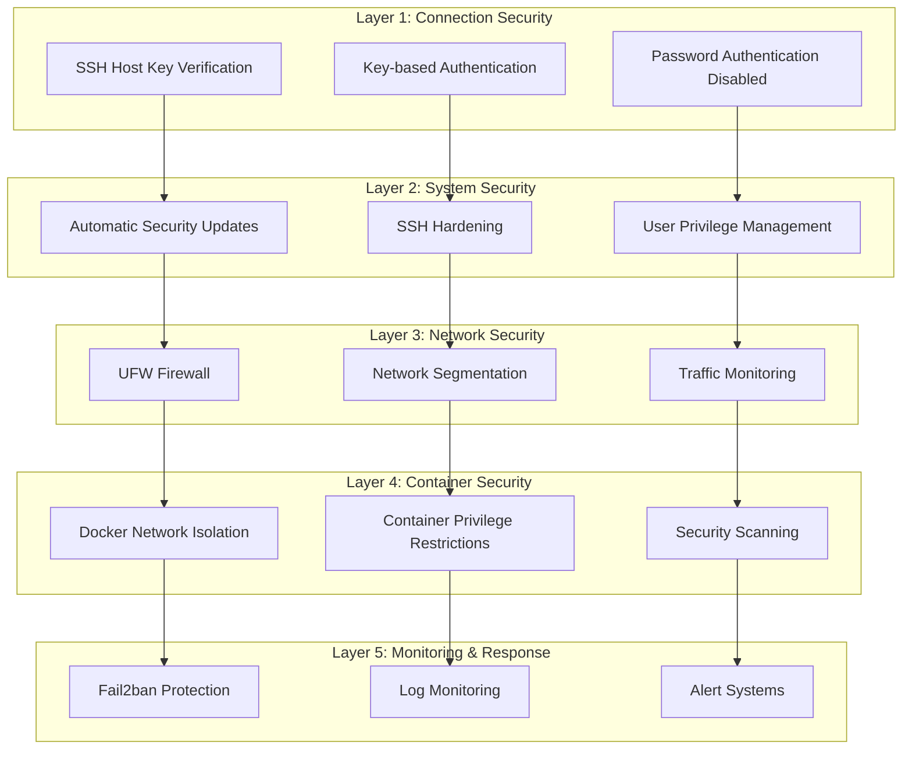

# Security Documentation

## Security Overview

This project implements a comprehensive multi-layered security approach to protect Ubuntu VPS servers and containerized applications. Security is built into every component, from initial connection to ongoing operations.

## Security Architecture

### Defense in Depth Strategy



## Security Components

### 1. SSH Security

#### Host Key Verification

- **Purpose**: Prevents man-in-the-middle attacks
- **Implementation**: Strict host key checking enabled
- **Configuration**: `inventory/known_hosts` file management
- **Commands**:

  ```bash
  # Add server host key
  ssh-keyscan -H your_server_ip >> inventory/known_hosts
  
  # Verify host key
  ssh -o StrictHostKeyChecking=yes your_server_ip
  ```

#### Authentication Security

- **Password Authentication**: Completely disabled
- **Key-based Authentication**: Required for all connections
- **Key Management**: Secure key storage and rotation procedures
- **User Restrictions**: Dedicated deployment user with limited privileges

#### SSH Hardening

- **Root Login**: Disabled
- **Empty Passwords**: Disabled
- **SSH Configuration**: Validated and secured
- **Connection Limits**: Rate limiting and timeout configurations

### 2. Network Security

#### UFW Firewall Configuration

- **Default Policy**: Deny all incoming, allow all outgoing
- **SSH Access**: Port 22 explicitly allowed
- **Web Services**: Ports 80, 443 allowed for web applications
- **Docker Networks**: Specific network ranges allowed
- **Logging**: All firewall activity logged

#### Docker Network Segmentation

- **Web Network** (172.20.0.0/16): Frontend services, load balancers
- **Database Network** (172.21.0.0/16): Databases, caches, backend services
- **Monitoring Network** (172.22.0.0/16): Monitoring, logging, metrics
- **Isolation**: Cross-network communication restricted
- **Audit Trail**: Network activity logged and monitored

#### Blocked Network Ranges

- **172.16.0.0/12**: Broad Docker network range
- **192.168.0.0/16**: Private network range
- **10.0.0.0/8**: Private network range
- **Rationale**: Prevents broad network access and potential attacks

### 3. Container Security

#### Docker Daemon Security

- **User Namespace Remapping**: Enabled for container isolation
- **No New Privileges**: Prevents privilege escalation
- **Live Restore**: Maintains container state during daemon restarts
- **Log Management**: Container logs with size limits and rotation

#### Container Network Security

- **Network Isolation**: Services isolated by network type
- **Port Exposure**: Only necessary ports exposed
- **Internal Communication**: Services communicate via internal networks
- **Security Scanning**: Container images validated before deployment

#### Container Privilege Restrictions

- **Non-root Users**: Containers run as non-root users when possible
- **Read-only Root**: Root filesystem mounted read-only where applicable
- **Capability Restrictions**: Unnecessary capabilities removed
- **Resource Limits**: CPU and memory limits enforced

### 4. System Security

#### Automatic Security Updates

- **Unattended Upgrades**: Automatic security patch installation
- **Email Notifications**: Security update alerts
- **Reboot Management**: Automatic reboots when required
- **Update Validation**: Security update verification

#### User Management

- **Deployment User**: Dedicated user for Ansible deployments
- **Sudo Restrictions**: Limited sudo privileges
- **Key-based Access**: SSH key authentication only
- **User Auditing**: User activity monitoring

#### System Hardening

- **Kernel Parameters**: Security-focused kernel configuration
- **Service Hardening**: Unnecessary services disabled
- **File Permissions**: Secure file and directory permissions
- **System Monitoring**: Continuous system health monitoring

### 5. Intrusion Prevention

#### Fail2ban Configuration

- **SSH Protection**: Brute force attack prevention
- **Ban Duration**: Configurable ban periods
- **Whitelist**: Trusted IP addresses excluded
- **Log Monitoring**: Failed login attempt detection
- **Email Alerts**: Intrusion attempt notifications

#### Monitoring and Alerting

- **System Monitoring**: Resource usage and service health
- **Security Events**: Failed authentication attempts
- **Network Monitoring**: Unusual network activity
- **Log Analysis**: Automated log analysis and alerting

## Security Configuration Files

### Ansible Security Configurations

#### Production Configuration (`ansible.prod.cfg`)

```ini
[defaults]
host_key_checking = true
stdout_callback = yaml
gathering = smart
fact_caching = memory
fact_caching_timeout = 7200
retry_files_enabled = false
interpreter_python = auto_silent

[ssh_connection]
ssh_args = -o ControlMaster=auto -o ControlPersist=60s -o UserKnownHostsFile=inventory/known_hosts
pipelining = true
```

#### Development Configuration (`ansible.dev.cfg`)

```ini
[defaults]
host_key_checking = false
stdout_callback = yaml
gathering = smart
fact_caching = memory
fact_caching_timeout = 7200
retry_files_enabled = false
interpreter_python = auto_silent

[ssh_connection]
ssh_args = -o ControlMaster=auto -o ControlPersist=60s -o UserKnownHostsFile=/dev/null -o StrictHostKeyChecking=no
pipelining = true
```

### Firewall Rules

#### UFW Configuration

```bash
# Default policies
ufw default deny incoming
ufw default allow outgoing

# SSH access
ufw allow 22/tcp

# Web services
ufw allow 80/tcp
ufw allow 443/tcp

# Docker networks (specific ranges only)
ufw allow from 172.20.0.0/16
ufw allow from 172.21.0.0/16
ufw allow from 172.22.0.0/16

# Block broad ranges
ufw deny from 172.16.0.0/12
ufw deny from 192.168.0.0/16
ufw deny from 10.0.0.0/8
```

### Docker Security Configuration

#### Daemon Security (`/etc/docker/daemon.json`)

```json
{
  "userns-remap": "default",
  "no-new-privileges": true,
  "live-restore": true,
  "log-driver": "json-file",
  "log-opts": {
    "max-size": "10m",
    "max-file": "3"
  }
}
```

## Security Best Practices

### 1. Key Management

- **Generate Strong Keys**: Use 4096-bit RSA or Ed25519 keys
- **Key Rotation**: Regular key rotation procedures
- **Secure Storage**: Keys stored with 600 permissions
- **Backup Keys**: Secure backup of all SSH keys

### 2. Network Security Best Practices

- **Principle of Least Privilege**: Only necessary network access
- **Network Monitoring**: Continuous traffic monitoring
- **Regular Audits**: Network configuration reviews
- **Documentation**: All network changes documented

### 3. Container Security Best Practices

- **Image Scanning**: Scan all container images before deployment
- **Base Images**: Use minimal, security-focused base images
- **Dependency Updates**: Regular dependency updates
- **Runtime Security**: Monitor container runtime behavior

### 4. System Security Best Practices

- **Regular Updates**: Automatic security updates enabled
- **Backup Procedures**: Regular system backups
- **Monitoring**: Continuous system monitoring
- **Incident Response**: Documented incident response procedures

## Security Monitoring

### 1. Log Monitoring

- **SSH Logs**: Monitor for failed login attempts
- **Firewall Logs**: Monitor network traffic patterns
- **Docker Logs**: Monitor container behavior
- **System Logs**: Monitor system events and errors

### 2. Alert Systems

- **Email Notifications**: Security event notifications
- **Failed Authentication**: Immediate alerts for failed logins
- **Network Anomalies**: Unusual network activity alerts
- **System Issues**: Resource and service health alerts

### 3. Security Auditing

- **Regular Scans**: Automated security scans
- **Configuration Reviews**: Periodic configuration audits
- **Access Reviews**: User access and privilege reviews
- **Compliance Checks**: Security compliance validation

## Incident Response

### 1. Detection

- **Automated Monitoring**: Continuous security monitoring
- **Alert Systems**: Immediate notification of security events
- **Log Analysis**: Automated log analysis and correlation
- **Anomaly Detection**: Unusual behavior detection

### 2. Response Procedures

- **Immediate Actions**: Containment and isolation procedures
- **Investigation**: Root cause analysis and investigation
- **Recovery**: System restoration and recovery procedures
- **Documentation**: Incident documentation and lessons learned

### 3. Recovery Procedures

- **Backup Restoration**: System restoration from backups
- **Configuration Recovery**: Security configuration restoration
- **Service Recovery**: Service restoration and validation
- **Post-Incident Review**: Analysis and improvement procedures

## Security Compliance

### 1. Standards Compliance

- **CIS Benchmarks**: Center for Internet Security benchmarks
- **NIST Guidelines**: National Institute of Standards and Technology guidelines
- **Industry Best Practices**: Industry-standard security practices
- **Regulatory Requirements**: Compliance with relevant regulations

### 2. Security Documentation

- **Configuration Documentation**: All security configurations documented
- **Procedure Documentation**: Security procedures and workflows
- **Incident Documentation**: Security incident documentation
- **Compliance Reports**: Regular compliance reporting

## Security Testing

### 1. Automated Testing

- **Network Security Tests**: Automated network security validation
- **Container Security Tests**: Container security scanning
- **Configuration Tests**: Security configuration validation
- **Integration Tests**: End-to-end security testing

### 2. Manual Testing

- **Penetration Testing**: Regular penetration testing
- **Vulnerability Assessment**: Regular vulnerability assessments
- **Security Audits**: Comprehensive security audits
- **Red Team Exercises**: Simulated attack scenarios

## Security Maintenance

### 1. Regular Maintenance

- **Security Updates**: Regular security patch installation
- **Configuration Updates**: Security configuration updates
- **Key Rotation**: Regular SSH key rotation
- **Backup Verification**: Regular backup testing and verification

### 2. Continuous Improvement

- **Security Reviews**: Regular security architecture reviews
- **Threat Assessment**: Ongoing threat assessment and analysis
- **Security Training**: Regular security awareness training
- **Process Improvement**: Continuous security process improvement

This comprehensive security approach ensures that all aspects of the system are protected against potential threats while maintaining operational efficiency and compliance with security standards.
