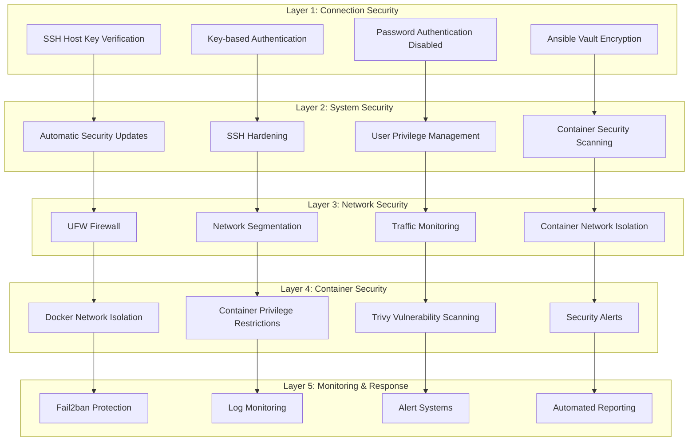

# Security Documentation

## Security Overview

This project implements a comprehensive multi-layered security approach to protect Ubuntu VPS servers and containerized applications. Security is built into every component, from initial connection to ongoing operations, with advanced features like container vulnerability scanning and secure secrets management.

## Security Architecture

### Defense in Depth Strategy



## Security Components

### 1. SSH Security

#### Host Key Verification

- **Purpose**: Prevents man-in-the-middle attacks
- **Implementation**: Strict host key checking enabled
- **Configuration**: `src/inventory/known_hosts` file management
- **Commands**:

  ```bash
  # Add server host key
  ssh-keyscan -H your_server_ip >> src/inventory/known_hosts
  
  # Verify host key
  ssh -o StrictHostKeyChecking=yes your_server_ip
  ```

#### Authentication Security

- **Password Authentication**: Completely disabled
- **Key-based Authentication**: Required for all connections
- **Key Management**: Secure key storage and rotation procedures
- **User Restrictions**: Dedicated deployment user with limited privileges

#### SSH Hardening

- **Root Login**: Disabled
- **Empty Passwords**: Disabled
- **SSH Configuration**: Validated and secured
- **Connection Limits**: Rate limiting and timeout configurations

### 2. Secrets Management

#### Ansible Vault Integration

- **Purpose**: Encrypt sensitive configuration data
- **Implementation**: All sensitive data stored in encrypted vault files
- **Configuration**: `secrets/vault.yml` with password protection
- **Commands**:

  ```bash
  # Encrypt sensitive data
  ansible-vault encrypt secrets/vault.yml
  
  # Edit encrypted file
  ansible-vault edit secrets/vault.yml
  
  # View encrypted file
  ansible-vault view secrets/vault.yml
  
  # Change vault password
  ansible-vault rekey secrets/vault.yml
  ```

#### Secure Environment Variables

- **Purpose**: Development-specific configuration overrides
- **Implementation**: Environment variables for non-sensitive overrides
- **Configuration**: `secrets/.env` file with secure defaults
- **Security**: Sensitive data never stored in environment variables

### 3. Network Security

#### UFW Firewall Configuration

- **Default Policy**: Deny all incoming, allow all outgoing
- **SSH Access**: Port 22 explicitly allowed
- **Web Services**: Ports 80, 443 allowed for web applications
- **Docker Networks**: Specific network ranges allowed
- **Logging**: All firewall activity logged

#### Docker Network Segmentation

- **Web Network (172.20.0.0/16)**: Web applications and frontend services
- **Database Network (172.21.0.0/16)**: Database and cache services
- **Monitoring Network (172.22.0.0/16)**: Monitoring and logging services
- **Network Isolation**: Services on different networks cannot communicate directly
- **Controlled Access**: Only necessary inter-network communication allowed

#### Network Security Testing

- **Automated Testing**: Network security validation playbooks
- **Isolation Verification**: Tests ensure proper network segmentation
- **Traffic Monitoring**: All network activity logged and monitored
- **Security Zones**: Clear separation of concerns by network type

### 4. Container Security

#### Trivy Vulnerability Scanning

- **Purpose**: Comprehensive container vulnerability scanning
- **Implementation**: Automated scanning of all Docker images
- **Configuration**: Configurable severity thresholds and scanning schedules
- **Features**:

  - **Image Scanning**: Scan all Docker images for vulnerabilities
  - **Running Container Scanning**: Scan running containers for security issues
  - **HTML Reports**: Beautiful vulnerability reports for analysis
  - **Email Alerts**: Automated security alerts for critical vulnerabilities
  - **Scheduled Scanning**: Automated daily vulnerability scans

#### Container Security Configuration

```yaml
# Container security settings
configure_container_security_enabled: true
configure_container_security_trivy_enabled: true
configure_container_security_alerts_enabled: true
configure_container_security_alert_email: "security@yourdomain.com"
configure_container_security_scan_images: true
configure_container_security_scan_running: true
configure_container_security_scan_schedule: "0 2 * * *"
configure_container_security_severity_threshold: "HIGH"
configure_container_security_ignore_unfixed: true
configure_container_security_auto_cleanup: true
```

#### Container Privilege Restrictions

- **Non-root Containers**: Containers run as non-root users when possible
- **Read-only Filesystems**: Container filesystems mounted as read-only
- **Resource Limits**: CPU and memory limits enforced
- **Network Restrictions**: Containers limited to specific networks

### 5. System Security

#### Automatic Security Updates

- **Purpose**: Keep system patched with latest security updates
- **Implementation**: Unattended-upgrades with email notifications
- **Configuration**: Automatic security patches with optional reboots
- **Monitoring**: Email alerts for security update status

#### Fail2ban Protection

- **Purpose**: Intrusion prevention and brute force protection
- **Implementation**: SSH brute force detection and IP banning
- **Configuration**: Configurable retry limits and ban durations
- **Monitoring**: Real-time monitoring of failed login attempts

#### User Privilege Management

- **Dedicated Users**: Separate users for different functions
- **Sudo Restrictions**: Limited sudo access for deployment user
- **Key-based Access**: All access via SSH keys only
- **Audit Trail**: All user actions logged and monitored

### 6. Log Security

#### Secure Log Management

- **Encrypted Logs**: Log archives encrypted with AES-256-CBC
- **Secure Transfer**: Logs downloaded securely via Ansible
- **Access Control**: Log access restricted to authorized users
- **Retention Policies**: Configurable log retention and cleanup

#### Log Collection Security

```yaml
# Log download security settings
configure_log_download_enabled: true
configure_log_download_secure_only: true
configure_log_download_encrypt_exports: true
configure_log_download_cleanup_passwords: true
configure_log_download_require_auth: true
configure_log_download_allowed_ips: []
```

#### Remote Logging Security

- **Encrypted Transport**: Logs transmitted over encrypted connections
- **Authentication**: Secure authentication for remote logging servers
- **Access Control**: Restricted access to remote logging infrastructure
- **Audit Trail**: Complete audit trail of all log transmissions

### 7. Monitoring and Alerting

#### Security Monitoring

- **Failed Login Monitoring**: Real-time monitoring of SSH login attempts
- **Network Anomaly Detection**: Monitoring for unusual network activity
- **Container Security Monitoring**: Continuous monitoring of container security
- **System Integrity Monitoring**: Monitoring for unauthorized system changes

#### Automated Alerts

- **Email Alerts**: Security alerts sent via encrypted email
- **Gmail SMTP**: Secure email delivery using Gmail App Passwords
- **Webhook Support**: Integration with Slack, Discord, and custom webhooks
- **Alert Thresholds**: Configurable thresholds for different alert types

#### Security Reporting

- **Daily Security Reports**: Daily security status reports
- **Vulnerability Reports**: Comprehensive vulnerability scanning reports
- **Security Dashboards**: HTML-based security dashboards
- **Trend Analysis**: Long-term security trend analysis

## Security Best Practices

### 1. Configuration Management

#### Secure Defaults

- **Principle of Least Privilege**: All services run with minimal required privileges
- **Secure by Default**: All security features enabled by default
- **Configuration Validation**: All configurations validated before deployment
- **Change Management**: All changes tracked and audited

#### Environment-Specific Security

- **Development Overrides**: Development-specific security relaxations via environment variables
- **Production Hardening**: Maximum security in production environments
- **Testing Procedures**: Comprehensive security testing before production deployment

### 2. Access Control

#### SSH Key Management

- **Key Rotation**: Regular SSH key rotation procedures
- **Key Storage**: Secure storage of SSH private keys
- **Key Distribution**: Secure distribution of SSH public keys
- **Key Revocation**: Procedures for revoking compromised keys

#### User Access Management

- **User Creation**: Secure procedures for creating new users
- **Access Review**: Regular review of user access permissions
- **Access Termination**: Secure procedures for terminating user access
- **Audit Logging**: Complete audit trail of all access events

### 3. Network Security setuo

#### Firewall Management

- **Default Deny**: Default deny policy for all incoming traffic
- **Explicit Allow**: Only explicitly allowed traffic permitted
- **Logging**: Comprehensive logging of all firewall activity
- **Monitoring**: Real-time monitoring of firewall events

#### Network Segmentation

- **Service Isolation**: Services isolated on separate networks
- **Traffic Control**: Controlled inter-network communication
- **Security Zones**: Clear security zones with appropriate controls
- **Monitoring**: Continuous monitoring of network traffic

### 4. Container Security setup

#### Image Security

- **Base Image Selection**: Use of minimal, secure base images
- **Vulnerability Scanning**: Regular scanning of all container images
- **Image Signing**: Digital signing of container images
- **Image Registry Security**: Secure access to container registries

#### Runtime Security

- **Privilege Restrictions**: Containers run with minimal privileges
- **Resource Limits**: Enforced resource limits for all containers
- **Network Isolation**: Containers isolated on specific networks
- **Security Monitoring**: Continuous monitoring of container security

## Security Monitoring and Response

### 1. Continuous Monitoring

#### System Monitoring

- **Resource Monitoring**: Continuous monitoring of system resources
- **Service Monitoring**: Monitoring of all critical services
- **Security Event Monitoring**: Real-time monitoring of security events
- **Performance Monitoring**: Monitoring of system performance

#### Security Event Detection

- **Intrusion Detection**: Automated detection of intrusion attempts
- **Anomaly Detection**: Detection of unusual system behavior
- **Vulnerability Detection**: Automated detection of security vulnerabilities
- **Compliance Monitoring**: Monitoring of security compliance

### 2. Incident Response

#### Response Procedures

- **Incident Classification**: Classification of security incidents by severity
- **Response Team**: Defined response team and procedures
- **Communication Plan**: Communication procedures for security incidents
- **Recovery Procedures**: Procedures for system recovery after incidents

#### Automated Response

- **Automatic Blocking**: Automatic blocking of suspicious IP addresses
- **Alert Escalation**: Automated escalation of security alerts
- **System Isolation**: Automatic isolation of compromised systems
- **Backup Activation**: Automatic activation of backup systems

### 3. Security Reporting

#### Regular Reports

- **Daily Security Reports**: Daily security status reports
- **Weekly Security Reports**: Weekly security analysis reports
- **Monthly Security Reports**: Monthly security compliance reports
- **Incident Reports**: Detailed reports for security incidents

#### Compliance Reporting

- **Security Compliance**: Reports on security compliance status
- **Vulnerability Reports**: Reports on system vulnerabilities
- **Access Reports**: Reports on user access and permissions
- **Audit Reports**: Reports on security audit findings

## Security Tools and Utilities

### 1. Built-in Security Tools

#### Ansible Vault

- **Purpose**: Encrypt sensitive configuration data
- **Usage**: Encrypt, edit, and manage sensitive files
- **Integration**: Integrated with all Ansible playbooks
- **Security**: Strong encryption with password protection

#### Trivy Scanner

- **Purpose**: Container vulnerability scanning
- **Usage**: Scan Docker images and running containers
- **Integration**: Integrated with container deployment
- **Output**: HTML reports and email alerts

#### UFW Firewall

- **Purpose**: Network firewall management
- **Usage**: Configure network access rules
- **Integration**: Integrated with Docker networks
- **Monitoring**: Comprehensive firewall logging

#### Fail2ban

- **Purpose**: Intrusion prevention
- **Usage**: Block malicious IP addresses
- **Integration**: Integrated with SSH and other services
- **Monitoring**: Real-time monitoring of access attempts

### 2. Security Scripts

#### Security Testing Scripts

```bash
# Test network security
ansible-playbook playbooks/test_network_security.yml

# Test container security
ansible-playbook playbooks/test_container_security.yml

# Test firewall configuration
ansible all -m shell -a "sudo ufw status verbose"
```

#### Security Monitoring Scripts

```bash
# Check security status
sudo /opt/security/check-security-status.sh

# Generate security report
sudo /opt/reports/generate-security-report.sh

# Monitor security events
sudo tail -f /var/log/security-events.log
```

## Security Compliance

### 1. Security Standards

#### Industry Standards

- **CIS Benchmarks**: Compliance with Center for Internet Security benchmarks
- **NIST Guidelines**: Compliance with NIST security guidelines
- **ISO 27001**: Alignment with ISO 27001 security standards
- **GDPR Compliance**: Compliance with data protection regulations

#### Security Frameworks

- **Defense in Depth**: Multi-layered security approach
- **Zero Trust**: Zero trust security model implementation
- **Security by Design**: Security built into all components
- **Continuous Security**: Continuous security monitoring and improvement

### 2. Security Auditing

#### Regular Audits

- **Security Assessments**: Regular security assessments
- **Vulnerability Assessments**: Regular vulnerability assessments
- **Penetration Testing**: Regular penetration testing
- **Compliance Audits**: Regular compliance audits

#### Audit Procedures

- **Audit Planning**: Comprehensive audit planning
- **Audit Execution**: Systematic audit execution
- **Audit Reporting**: Detailed audit reporting
- **Audit Follow-up**: Follow-up on audit findings

## Emergency Procedures

### 1. Security Incidents

#### Incident Response

1. **Immediate Response**:
   - Isolate affected systems
   - Block suspicious IP addresses
   - Preserve evidence
   - Notify security team

2. **Investigation**:
   - Analyze security logs
   - Identify root cause
   - Assess impact
   - Document findings

3. **Recovery**:
   - Restore from backups
   - Patch vulnerabilities
   - Update security measures
   - Test system integrity

4. **Post-Incident**:
   - Review incident response
   - Update procedures
   - Conduct lessons learned
   - Implement improvements

### 2. Data Breach Response

#### Breach Procedures

1. **Detection**:
   - Monitor for data breaches
   - Identify affected data
   - Assess breach scope
   - Notify authorities if required

2. **Containment**:
   - Stop data exfiltration
   - Secure affected systems
   - Preserve evidence
   - Notify affected parties

3. **Recovery**:
   - Restore data from backups
   - Patch security vulnerabilities
   - Implement additional security measures
   - Monitor for further incidents

### 3. System Compromise

#### Compromise Response

1. **Immediate Actions**:
   - Disconnect from network
   - Preserve system state
   - Document compromise details
   - Notify security team

2. **Investigation**:
   - Analyze compromise method
   - Identify affected systems
   - Assess data exposure
   - Document timeline

3. **Recovery**:
   - Rebuild compromised systems
   - Restore from clean backups
   - Implement security improvements
   - Test system integrity

This security documentation now reflects the comprehensive security features of the current project, including Ansible Vault for secrets management, Trivy container security scanning, secure log management, and advanced monitoring and reporting capabilities.
